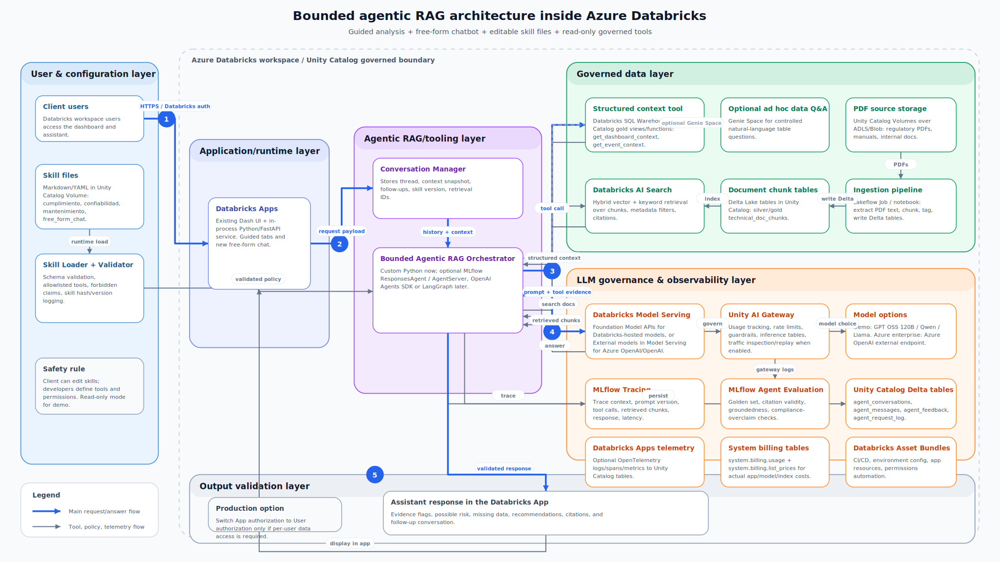

# Databricks-native bounded agentic RAG assistant: development update plan, architecture, and cost analysis

**Project context:** existing CHEC dashboard deployed as a **Databricks App** with Dash/FastAPI-style Python code, Databricks SQL backend support, chatbot API/schema/service modules, Databricks App deployment scripts, and a prototype document corpus built from PDFs/XLSX into local/volume JSONL chunks.

**Target:** evolve the existing assistant into a **bounded agentic RAG assistant** inside **Databricks Apps**. The assistant should support both:

1. **Guided analysis** using the current Confiabilidad / Cumplimiento / Mantenimiento workflow.
2. **Free-form conversation** with memory over the current dashboard context, technical PDFs, and approved read-only Databricks tools.

The client should be able to adjust behavior through governed text files that act like “skills,” while developers keep control over tools, permissions, models, and production code.

---

## 1. Target architecture figure

The proposed architecture is shown below. The source file is also delivered as `databricks_agentic_rag_architecture.svg`.



### Architecture summary

```text
User in Databricks App
  -> Dash assistant UI
  -> Python agent backend inside Databricks Apps
  -> Skill loader reads Markdown/YAML from Unity Catalog Volumes
  -> Conversation manager loads previous turns and selected dashboard context
  -> Agent router chooses guided or free-form flow
  -> Read-only tools:
       Databricks SQL Warehouse
       Unity Catalog Functions
       Databricks AI Search
       Optional Genie Space
       Optional Databricks managed MCP servers
  -> Databricks Model Serving endpoint
       Foundation Model APIs or External models in Model Serving
  -> Answer validator
       structured sections, citations, evidence flags, possible-risk wording
  -> MLflow Tracing + Delta conversation history
```

---

## 2. Core design decisions

| Decision | Recommendation | Why |
|---|---|---|
| Overall pattern | **Bounded agentic RAG** | Agentic enough for tool selection, follow-ups, retrieval, and memory; bounded enough for enterprise safety. |
| App runtime | **Databricks Apps** | The dashboard is already a Databricks App; avoid introducing Flowise/Langflow/Dify/Hermes/OpenClaw as a second runtime. |
| UI | Keep current guided workflow and add a free-form chat panel | The current workflow gives reliable context; free-form chat improves usability. |
| Data access | **App authorization** first | For demo, all users use the Databricks App service principal permissions. Later, evaluate user authorization if per-user access matters. |
| Documents | **Unity Catalog Volumes** + **Delta tables** + **Databricks AI Search** | Best fit for PDFs, citations, metadata filtering, and hybrid search. |
| Structured data | **Databricks SQL Warehouse** + **Unity Catalog Functions** | Prevent arbitrary SQL from the LLM. Use approved read-only functions. |
| LLM | **Databricks Model Serving** with **Foundation Model APIs** or **External models in Model Serving** | Keeps model usage governable from Databricks. |
| Skills | Markdown/YAML in **Unity Catalog Volumes**, optionally promoted to Delta + MLflow Prompt Registry | Gives the client a low-code control surface without letting them write SQL/Python. |
| Observability | **MLflow 3 for GenAI** | Required for tracing, evaluation, feedback, prompt/version comparison, and production monitoring. |
| Governance | **Unity Catalog** + later **Unity AI Gateway** | Permissions, endpoint governance, usage tracking, MCP visibility, and production controls. |

---

## 3. Current repository baseline

The uploaded project already contains several useful pieces.

| Current file/path | Current role | Update direction |
|---|---|---|
| `src/chec_dashboard/pages/chatbot_page.py` | Dash assistant UI | Keep and extend with conversation thread, free-form mode, feedback, and citations. |
| `src/chec_dashboard/api/routes/chatbot.py` | Chatbot API routes | Extend routes for thread creation, follow-up turns, skill status, and feedback. |
| `src/chec_dashboard/api/schemas/chatbot.py` | Pydantic request/response schemas | Add structured response, conversation IDs, trace IDs, skill IDs, and citations. |
| `src/chec_dashboard/services/chatbot_service.py` | Current all-in-one chatbot service | Split into context, retrieval, LLM, skill, prompt, conversation, and validation services. |
| `scripts/build_chatbot_corpus.py` | Builds local/JSONL corpus | Keep for local fallback; add Databricks ingestion job to write Delta chunks and AI Search index. |
| `databricks/apps/chec_dash_parity/app.yaml` | Databricks App runtime config | Add LLM endpoint, AI Search index, skill volume, MLflow, and conversation table settings. |
| `databricks/scripts/apply_phase35_app_permissions.sh` | Permissions script | Extend for Model Serving endpoint, AI Search index, MLflow experiment, UC Volumes, Delta history tables. |
| `databricks/scripts/upload_chatbot_assets.sh` | Uploads chatbot assets to UC Volume | Extend to upload skill files and seed demo documents. |
| `databricks/databricks.yml` | Databricks bundle | Add agent resources: jobs, AI Search index metadata, MLflow experiment, permissions. |

---

## 4. Phased development roadmap

### Phase 0 — Scope lock and implementation assumptions

**Goal:** confirm the exact demo constraints before development.

**Decisions to lock:**

- Model route: `Foundation Model APIs` or `External models in Model Serving`.
- Authorization mode: `Databricks Apps App authorization` for demo.
- Document mode: mostly digital PDFs; OCR only if later needed.
- Assistant mode: read-only.
- Compliance language: evidence flags and possible risk only.
- UX: keep guided workflow and add free-form chat with memory.

**Databricks services/tools:**

- Databricks Apps
- Unity Catalog
- Databricks SQL Warehouse
- Databricks Model Serving
- Databricks AI Search
- MLflow 3 for GenAI

**Deliverables:**

- Final architecture decision record.
- Demo acceptance criteria.
- Model provider decision.
- Permission model decision.

**Acceptance criteria:**

- The model cannot run arbitrary SQL.
- The assistant cannot write business data.
- Compliance language is explicitly restricted.
- Skill files can adjust behavior but not create new tools.

---

### Phase 1 — Refactor the current chatbot into agent service modules

**Goal:** make the current prototype maintainable and ready for Databricks-native retrieval/model serving.

**Create new modules:**

```text
src/chec_dashboard/services/skill_service.py
src/chec_dashboard/services/agent_context_service.py
src/chec_dashboard/services/conversation_service.py
src/chec_dashboard/services/retrieval_service.py
src/chec_dashboard/services/llm_service.py
src/chec_dashboard/services/prompt_service.py
src/chec_dashboard/services/citation_service.py
src/chec_dashboard/services/agent_trace_service.py
src/chec_dashboard/services/agent_orchestrator.py
```

**Modify existing modules:**

```text
src/chec_dashboard/services/chatbot_service.py
src/chec_dashboard/api/schemas/chatbot.py
src/chec_dashboard/api/routes/chatbot.py
src/chec_dashboard/pages/chatbot_page.py
src/chec_dashboard/core/config.py
.env.example
```

**Technologies/tools:**

- Python
- Pydantic
- Dash callbacks
- FastAPI/in-process API pattern already used by the app
- Databricks Apps environment variables

**Implementation details:**

- Convert `chatbot_service.py` into a thin orchestrator.
- Add provider-neutral model config:

```text
LLM_PROVIDER=mock|databricks_model_serving|azure_openai|openai|gemini
LLM_ENDPOINT_NAME=
DATABRICKS_MODEL_ENDPOINT=
```

- Keep Gemini only as an optional prototype backend; do not make it the production default.
- Add `conversation_id`, `turn_id`, `skill_id`, `skill_version`, and `trace_id` to schemas.

**Deliverables:**

- Modular services.
- Provider-neutral LLM interface.
- Backward-compatible existing guided assessment API.
- Tests for service boundaries.

**Acceptance criteria:**

- Existing guided assistant still works with `LLM_PROVIDER=mock`.
- No production code path is hardcoded to Gemini.
- Unit tests can run without Databricks credentials.

---

### Phase 2 — Add governed skill files

**Goal:** let the client modify instructions and behavior through text files without editing Python.

**Recommended storage:**

```text
/Volumes/chec_dbx_demo/agent_config/skills/active/
/Volumes/chec_dbx_demo/agent_config/skills/draft/
/Volumes/chec_dbx_demo/agent_config/skills/archive/
```

**Initial skill files:**

```text
cumplimiento.yml
confiabilidad.yml
mantenimiento.yml
free_form_chat.yml
global_policy.yml
retrieval_policy.yml
```

**Allowed skill controls:**

- Role/instructions.
- Answer sections.
- Tone and language.
- Suggested questions.
- Retrieval tags and top-k.
- Allowed read-only tools from a fixed allowlist.
- Forbidden wording.
- Citation requirements.
- Missing-evidence behavior.

**Blocked skill controls:**

- SQL text.
- Python code.
- API keys.
- URLs for new tools.
- Model endpoint changes.
- Write actions.
- Permission changes.

**Example skill fragment:**

```yaml
skill_id: cumplimiento
version: 1.0
status: active
allowed_tools:
  - get_dashboard_context
  - search_regulatory_documents
  - get_event_context
output:
  sections:
    - Estado observado
    - Banderas de evidencia
    - Requisitos posiblemente aplicables
    - Datos faltantes
    - Riesgo posible
    - Recomendaciones
    - Citas
constraints:
  must_cite_regulatory_claims: true
  cannot_make_legal_conclusions: true
  forbidden_phrases:
    - incumplimiento confirmado
    - sanción aplicable
    - responsabilidad legal demostrada
retrieval:
  backend: databricks_ai_search
  top_k: 8
  boost_tags:
    - CREG
    - calidad_servicio
    - cumplimiento
    - SAIDI
    - SAIFI
```

**Databricks services/tools:**

- Unity Catalog Volumes
- Unity Catalog permissions: `READ_VOLUME`, optionally `WRITE_VOLUME` for admin/editors
- Optional Delta skill registry table
- Optional MLflow Prompt Registry for production prompt versioning

**Deliverables:**

- Skill schema.
- Skill loader.
- Skill validator.
- Sample skill files.
- Skill status endpoint.

**Acceptance criteria:**

- Client can edit a YAML/Markdown file to change answer sections and instructions.
- Invalid skill files are rejected with clear errors.
- Every answer logs `skill_id`, `skill_version`, and `skill_hash`.

---

### Phase 3 — Add conversation memory for guided and free-form modes

**Goal:** keep the conversation going after the first guided analysis and support free-form chat.

**New API endpoints:**

```text
POST /chatbot/conversations
POST /chatbot/conversations/{conversation_id}/messages
GET  /chatbot/conversations/{conversation_id}
POST /chatbot/feedback
```

**Conversation tables:**

```text
chec_dbx_demo.agent.agent_conversations
chec_dbx_demo.agent.agent_messages
chec_dbx_demo.agent.agent_feedback
```

**Suggested fields:**

```text
conversation_id
turn_id
created_at
user_id_hash
mode
guided_context_snapshot_json
skill_id
skill_version
skill_hash
user_message
assistant_message
retrieved_chunk_ids
model_endpoint_name
mlflow_trace_id
feedback
```

**Memory rules:**

- Guided mode starts with a context snapshot from the dashboard filters.
- Follow-ups reuse the same snapshot unless filters change.
- After N turns, summarize older history into a compact memory object.
- Store only what is needed for traceability; avoid storing secrets or raw auth tokens.

**Databricks services/tools:**

- Delta Lake tables governed by Unity Catalog
- Databricks SQL Warehouse for reading/writing conversation tables
- MLflow trace ID linked to each turn

**Deliverables:**

- Conversation persistence.
- Follow-up support inside guided workflow.
- Free-form chat panel.
- Feedback capture.

**Acceptance criteria:**

- User can ask: “¿Y eso cómo afecta mantenimiento?” and the assistant uses prior context.
- Old turns remain traceable by context, skill version, citations, and model endpoint.
- Conversations survive app restart.

---

### Phase 4 — Formalize structured dashboard context tools

**Goal:** stop giving the LLM raw/unbounded access; expose curated read-only tools.

**Recommended Unity Catalog Functions:**

```text
get_dashboard_context(period, municipio, circuits)
get_reliability_summary(period, municipio, circuits)
get_compliance_context(period, municipio, circuits)
get_event_context(event_id)
get_asset_context(asset_id)
get_circuit_history(circuit, start_date, end_date)
```

**Recommended curated views/tables:**

```text
chec_dbx_demo.gold.gold_agent_view_context
chec_dbx_demo.gold.gold_agent_event_context
chec_dbx_demo.gold.gold_agent_asset_context
chec_dbx_demo.gold.gold_agent_circuit_history
```

**Databricks services/tools:**

- Unity Catalog
- Unity Catalog Functions
- Databricks SQL Warehouse
- Databricks managed MCP server for Unity Catalog functions, optional

**Deliverables:**

- Context service.
- Curated views/functions.
- Tool output schema.
- Tests for view/event/asset context.

**Acceptance criteria:**

- The LLM never generates arbitrary SQL.
- Every structured-data claim can be traced to a function/view.
- All tools are read-only.

---

### Phase 5 — Move PDF corpus from JSONL to Delta + Databricks AI Search

**Goal:** replace lexical JSONL retrieval with governed hybrid search over PDFs.

**Data pipeline:**

```text
Unity Catalog Volume with PDFs
  -> Lakeflow Jobs / Databricks Job
  -> PDF extraction and chunking
  -> silver.technical_doc_chunks
  -> gold.technical_doc_chunks_current
  -> Databricks AI Search index
```

**Recommended chunk metadata:**

```text
chunk_id
document_id
document_title
document_type
source_path
source_uri
page
section_title
section_number
effective_date
version
jurisdiction
topic_tags
analysis_tags
authority_level
text
text_hash
created_at
```

**Retrieval implementation:**

```text
RETRIEVER_BACKEND=local_jsonl|databricks_ai_search
AI_SEARCH_ENDPOINT_NAME=
AI_SEARCH_INDEX_NAME=
AI_SEARCH_TOP_K=8
AI_SEARCH_QUERY_TYPE=hybrid
```

**Databricks services/tools:**

- Unity Catalog Volumes
- Delta Lake
- Lakeflow Jobs or Databricks Workflows Jobs
- Databricks AI Search
- Optional AI Search managed MCP server

**Deliverables:**

- Delta chunk tables.
- AI Search endpoint/index.
- `DatabricksAISearchRetriever`.
- Local JSONL fallback for tests.
- Citation metadata returned to UI.

**Acceptance criteria:**

- Retrieved citations include title, path, page/section, and snippet.
- Exact terms like `CREG 015`, `SAIDI`, `SAIFI`, and circuit codes are retrievable.
- Relevant chunks appear in top 3/top 5 for the golden test questions.

---

### Phase 6 — Integrate production LLM through Databricks Model Serving

**Goal:** move from direct Gemini-style calls to a governed model endpoint.

**Preferred routes:**

1. **Foundation Model APIs** through **Databricks Model Serving**.
2. **External models in Model Serving** if the client wants Azure OpenAI/OpenAI/Anthropic/Cohere/Vertex/Bedrock.
3. Direct vendor API only for prototype/fallback, not recommended for production governance.

**Provider-neutral interface:**

```python
class LLMClient:
    def generate(self, messages, *, response_schema=None, tools=None):
        ...
```

**Implementations:**

```text
MockLLMClient
DatabricksModelServingLLMClient
AzureOpenAILLMClient, optional
OpenAICompatibleExternalModelClient, optional
GeminiLLMClient, optional prototype only
```

**Databricks services/tools:**

- Databricks Model Serving
- Foundation Model APIs
- External models in Model Serving
- Unity AI Gateway, later production

**Deliverables:**

- Model provider abstraction.
- Databricks Model Serving client.
- Timeout/retry behavior.
- Token/latency logging.
- Graceful model failure messages in Spanish.

**Acceptance criteria:**

- Model endpoint can be changed by config, not code.
- No secrets are stored in code or app YAML.
- All model calls are traceable.

---

### Phase 7 — Add bounded agentic orchestration and optional MCP

**Goal:** make the free-form assistant capable of choosing approved tools, while keeping the system read-only.

**Agent behavior:**

- Load skill file.
- Load conversation context.
- Decide whether the request needs:
  - structured dashboard context,
  - event/asset history,
  - PDF retrieval,
  - optional Genie ad hoc structured Q&A,
  - or a direct answer from already available evidence.
- Retrieve and validate evidence.
- Generate structured answer.
- Store trace and conversation turn.

**Tool allowlist:**

```text
get_dashboard_context
get_event_context
get_asset_context
get_reliability_summary
search_regulatory_documents
optional_ask_genie_space
```

**Databricks services/tools:**

- Unity Catalog Functions
- Databricks AI Search
- Genie Spaces, optional
- Databricks managed MCP servers, optional
- MLflow ResponsesAgent, optional if you package agent as a reusable endpoint
- MLflow AgentServer, optional if you deploy an agent server pattern

**MCP recommendation:**

Use MCP later, not necessarily in the first demo. If used, prefer:

- AI Search MCP server.
- Unity Catalog functions MCP server.
- Genie Space MCP server.

Avoid exposing the general Databricks SQL MCP server in the first client-facing version because predefined read-only Unity Catalog Functions are safer.

**Deliverables:**

- Agent router.
- Tool allowlist.
- Tool result sanitizer.
- Multi-turn free-form chat.
- Optional MCP configuration document.

**Acceptance criteria:**

- Agent can choose between documents and structured context.
- Agent cannot call tools not listed in the active skill.
- Agent cannot mutate data.

---

### Phase 8 — Add structured answers, citation validation, and compliance language controls

**Goal:** make answers consistent and safe for evidence/risk analysis.

**Structured output schema:**

```text
estado_observado
banderas_evidencia
requisitos_posiblemente_aplicables
datos_faltantes
riesgo_posible
recomendaciones
limitaciones
citas_usadas
preguntas_sugeridas
```

**Compliance language policy:**

Allowed:

```text
posible riesgo
evidencia disponible
bandera de evidencia
dato faltante
recomendación de verificación
```

Blocked unless later approved:

```text
incumplimiento confirmado
cumple / no cumple
sanción aplicable
responsabilidad legal demostrada
```

**Databricks services/tools:**

- Skill files in Unity Catalog Volumes
- MLflow Prompt Registry, optional production
- MLflow Tracing

**Deliverables:**

- Prompt templates by skill.
- Structured response validator.
- Citation validator.
- UI renderer for sections.

**Acceptance criteria:**

- Every regulatory claim has a citation.
- Missing evidence is explicitly surfaced.
- The model does not overclaim compliance conclusions.

---

### Phase 9 — Observability, evaluation, and production readiness

**Goal:** make the assistant auditable, measurable, and improvable.

**Trace each turn:**

```text
conversation_id
turn_id
skill_id
skill_hash
context_snapshot_hash
tool_calls
retrieved_chunk_ids
prompt_version
model_endpoint
latency
answer
citations
feedback
```

**Evaluation set:**

Create 30–100 SME-reviewed examples covering:

- SAIDI/SAIFI explanation.
- CREG/quality-service questions.
- Maintenance prioritization.
- Missing evidence cases.
- Ambiguous questions.
- Follow-ups that require memory.

**Metrics:**

```text
retrieval_precision_at_3
citation_validity
groundedness
answer_completeness
compliance_overclaim_rate
latency_p95
failure_rate
cost_per_answer
```

**Databricks services/tools:**

- MLflow 3 for GenAI
- MLflow Tracing
- MLflow Agent Evaluation
- MLflow Prompt Registry
- Databricks App telemetry to Unity Catalog tables
- Unity AI Gateway for production governance

**Deliverables:**

- MLflow experiment.
- Trace integration.
- Evaluation notebook/job.
- Feedback UI.
- Production readiness checklist.

**Acceptance criteria:**

- Every production answer has a trace.
- Prompt/skill/model/retriever versions can be compared.
- A release can be blocked if citation or overclaim checks fail.

---

## 5. Suggested implementation timeline

### Demo path: 3–4 weeks

| Week | Scope | Result |
|---|---|---|
| 1 | Refactor services, add skill loader, add conversation schema | Existing assistant becomes modular and configurable. |
| 2 | Add conversation memory and free-form chat | Guided and free-form assistant share one backend. |
| 3 | Add Delta chunk table + Databricks AI Search + Model Serving client | RAG becomes Databricks-native. |
| 4 | Add tracing, citation validation, demo polish, permissions | Demo-ready governed bounded agentic RAG assistant. |

### Production path: 6–10 weeks

| Phase | Scope | Result |
|---|---|---|
| Production hardening | CI/CD, app permissions, secret management, telemetry | Deployable by environment. |
| Evaluation | Golden set, SME review, MLflow Agent Evaluation | Measurable quality. |
| Governance | Unity AI Gateway, prompt/skill approval, audit checks | Client-ready operating model. |
| Scale | performance testing, caching, warehouse/index sizing | Production sizing and cost confidence. |

---

## 6. Cost analysis

### 6.1 Important pricing assumptions

1. Databricks prices vary by cloud, region, workspace tier, product SKU, and client agreement.
2. Azure Databricks uses DBUs for many Databricks-managed services; the public Databricks AI Search pricing example shows **US East $0.07 per DBU** for its sample calculation. This document uses `$0.07/DBU` only as an **illustrative public-price conversion** where a product page gives DBU quantities but not direct USD.
3. Exact prices for the client should be confirmed with:
   - the client’s Azure Databricks billing account,
   - Databricks Pricing Calculator,
   - Generative AI Pricing Calculator,
   - Azure Pricing Calculator,
   - and the client’s contracted discounts.
4. Databricks App, SQL Warehouse, Jobs, MLflow, AI Gateway, and Azure storage pages may not expose a single static numeric price in web text because prices are dynamic by region/SKU. For these, this document provides pricing formulas and sizing variables.

---

### 6.2 Cost components by architecture layer

| Layer | Service/tool | Charge model | Demo cost impact | Production cost impact |
|---|---|---|---|---|
| App runtime | Databricks Apps | Billed per hour of compute time while running, based on provisioned capacity | Usually small/moderate; can be limited by running only when needed for demo | 24/7 app runtime becomes a fixed monthly cost |
| Structured data | Databricks SQL Warehouse | Warehouse compute while running / serverless SQL pricing | Often already exists for the dashboard; marginal cost may be low | Depends on concurrency, warehouse size, auto-stop, query frequency |
| Structured tools | Unity Catalog Functions | Uses serverless general compute when called through managed MCP; otherwise depends on SQL/job execution path | Low if functions are simple summaries | Scales with calls and query complexity |
| Document storage | Unity Catalog Volumes backed by Azure storage | Azure Blob/ADLS storage + transactions | Usually negligible for a small PDF corpus | Scales with PDF volume, chunk tables, logs, versions |
| PDF ingestion | Lakeflow Jobs / Databricks Jobs | Job compute runtime | Low if run on demand for demo | Depends on refresh frequency and corpus size |
| Document retrieval | Databricks AI Search | Hourly per AI Search unit | Meaningful fixed cost if left running 24/7 | Major fixed cost driver as vector count grows |
| Embeddings | Foundation Model APIs embedding model | DBU per million input tokens | Very low for small corpus | Low/moderate for large corpora or frequent re-indexing |
| Generation model | Foundation Model APIs or External models in Model Serving | DBU/token or vendor token pricing | Usually low for demo traffic | Scales directly with chat usage and output length |
| Optional ad hoc data Q&A | Genie Spaces | Serverless SQL compute pricing | Optional; skip for first demo if cost-sensitive | Useful but monitor usage |
| Tool protocol | Databricks managed MCP servers | Depends on underlying feature: AI Search, UC functions, SQL, Genie | Optional; can skip first demo | Useful for standardization and tool governance |
| Model governance | Unity AI Gateway | Usage tracking/inference tables charged by payload increments; exact cost depends on configuration | Optional for demo; recommended for production | Important for cost attribution and centralized governance |
| Observability | MLflow 3 for GenAI | Managed MLflow/storage/evaluation costs + LLM judge tokens | Low if tracing only | Evaluation and monitoring can become meaningful if using LLM judges heavily |
| Conversation memory | Delta tables in Unity Catalog | Storage + SQL/warehouse operations | Low | Low/moderate depending on retention and usage |

---

### 6.3 Numeric costs available from public Databricks pricing pages

#### Databricks AI Search

Public Databricks pricing lists:

| AI Search version | Vector capacity per unit | Price/hour/unit | DBU/hour |
|---|---:|---:|---:|
| Standard | 2,000,000 vectors at 768 dimensions | `$0.28` | `4.00` |
| Storage Optimized | 64,000,000 vectors at 768 dimensions | `$1.28` | `18.29` |

Monthly examples using 720 hours/month:

| Scenario | Units | Monthly formula | Estimated monthly cost |
|---|---:|---|---:|
| Small/demo corpus below 2M vectors, Standard | 1 | `1 × 720 × $0.28` | `$201.60/month` |
| 5M vectors, Standard | 3 | Public Databricks example | About `$605/month` in US East |
| 50M vectors, Storage Optimized | 1 | Public Databricks example | About `$922/month` in US East |

For your PDF corpus, the number of vectors is likely far below 2M in the demo, so **one Standard AI Search unit** is the first sizing assumption. The main question is whether the AI Search endpoint must be available 24/7 or only during demo/pilot hours.

#### Databricks Foundation Model Serving pay-per-token

Public Databricks pricing lists DBUs per million tokens for Foundation Model Serving. Using an illustrative `$0.07/DBU` conversion from the AI Search US East example:

| Model | DBU / M input tokens | DBU / M output tokens | Illustrative USD / M input | Illustrative USD / M output |
|---|---:|---:|---:|---:|
| Llama 4 Maverick | 7.143 | 21.429 | `$0.50` | `$1.50` |
| Llama 3.3 70B | 7.143 | 21.429 | `$0.50` | `$1.50` |
| Qwen 3 Next 80B | 2.143 | 17.143 | `$0.15` | `$1.20` |
| GPT OSS 120B | 2.143 | 8.571 | `$0.15` | `$0.60` |
| Gemma 3 12B | 2.143 | 7.143 | `$0.15` | `$0.50` |
| Llama 3.1 8B | 2.143 | 6.429 | `$0.15` | `$0.45` |
| GPT OSS 20B | 1.000 | 4.286 | `$0.07` | `$0.30` |
| Qwen 3 0.6B Embedding | 0.286 | n/a | `$0.02` | n/a |
| GTE | 1.857 | n/a | `$0.13` | n/a |

**Important:** these USD conversions are illustrative. The official Databricks page gives DBU/M-token rates; the actual USD rate depends on the client’s Azure Databricks price/contract.

---

### 6.4 Demo usage examples

#### Assumption A — 2,000 assistant turns/month

Assume each turn averages:

```text
10,000 input tokens
1,500 output tokens
```

Monthly tokens:

```text
Input: 2,000 × 10,000 = 20,000,000 input tokens = 20M
Output: 2,000 × 1,500 = 3,000,000 output tokens = 3M
```

Illustrative Foundation Model Serving cost at `$0.07/DBU`:

| Model | Input cost | Output cost | Monthly generation cost |
|---|---:|---:|---:|
| GPT OSS 120B | `20 × $0.15 = $3.00` | `3 × $0.60 = $1.80` | `$4.80` |
| Qwen 3 Next 80B | `20 × $0.15 = $3.00` | `3 × $1.20 = $3.60` | `$6.60` |
| Llama 3.3 70B | `20 × $0.50 = $10.00` | `3 × $1.50 = $4.50` | `$14.50` |

The generation cost is likely not the main cost for a demo. The fixed AI Search endpoint, Databricks App runtime, and SQL Warehouse/runtime costs usually matter more.

#### Assumption B — 10,000 assistant turns/month

Monthly tokens:

```text
Input: 100M
Output: 15M
```

Illustrative Foundation Model Serving cost:

| Model | Input cost | Output cost | Monthly generation cost |
|---|---:|---:|---:|
| GPT OSS 120B | `$15.00` | `$9.00` | `$24.00` |
| Qwen 3 Next 80B | `$15.00` | `$18.00` | `$33.00` |
| Llama 3.3 70B | `$50.00` | `$22.50` | `$72.50` |

Again, these estimates exclude Databricks App, SQL Warehouse, AI Search, ingestion, storage, evaluation, and any external vendor model costs.

---

### 6.5 Embedding/indexing estimate for PDFs

Assume the PDF corpus produces **5M embedding input tokens**.

| Embedding model | Illustrative USD / M input tokens | One-time embedding cost for 5M tokens |
|---|---:|---:|
| Qwen 3 0.6B Embedding | `$0.02` | `$0.10` |
| GTE | `$0.13` | `$0.65` |

This is only the model embedding cost. AI Search endpoint/index serving cost is separate and usually larger.

---

### 6.6 External model alternative

If the client requires OpenAI/Azure OpenAI instead of Databricks-hosted Foundation Model APIs, use **External models in Model Serving** when possible. This keeps the endpoint governed by Databricks while the underlying model cost follows the external provider’s pricing.

Official OpenAI public API pricing currently lists:

| OpenAI model | Input / 1M tokens | Cached input / 1M tokens | Output / 1M tokens |
|---|---:|---:|---:|
| GPT-5.5 | `$5.00` | `$0.50` | `$30.00` |
| GPT-5.4 | `$2.50` | `$0.25` | `$15.00` |
| GPT-5.4 mini | `$0.75` | `$0.075` | `$4.50` |

Azure OpenAI pricing should be confirmed in the client’s Azure region and offer. The official Azure page describes both Pay-As-You-Go and Provisioned Throughput Units, but the static crawl used for this document rendered dynamic prices as `$-`; therefore, use Azure Pricing Calculator or the client’s Azure quote for exact Azure OpenAI numbers.

---

### 6.7 First-pass monthly demo budget structure

For a demo/pilot, estimate in this order:

| Component | First-pass estimate approach |
|---|---|
| Databricks App runtime | `app runtime hours × configured app capacity rate` from Databricks/Azure calculator. |
| Databricks AI Search | Start with Standard 1 unit: `720 × $0.28 = $201.60/month` if 24/7. |
| Foundation Model Serving generation | Use expected turns × token estimate; likely under `$20/month` for a small demo with Databricks-hosted OSS models under the illustrative rate. |
| Embedding PDFs | Usually one-time and very low for a small PDF corpus; AI Search serving dominates. |
| Databricks SQL Warehouse | If existing dashboard warehouse is reused, track marginal queries; otherwise estimate warehouse runtime. |
| Lakeflow/Jobs ingestion | Run on demand; estimate job compute hours only. |
| MLflow tracing | Storage + managed MLflow/evaluation; tracing-only is small; LLM judge evaluation adds model-token cost. |
| Azure storage | Usually small for PDFs/chunk tables/logs; confirm with Azure calculator. |

A realistic demo budget usually has these dominant items:

```text
1. Databricks AI Search fixed hourly serving
2. Databricks App runtime
3. SQL Warehouse runtime if not already running
4. Model generation tokens
5. Evaluation/monitoring, if enabled heavily
```

---

## 7. Permissions checklist

Use **Databricks Apps App authorization** for the demo.

The Databricks App service principal should receive minimum permissions:

| Resource | Permission |
|---|---|
| Databricks App | Users: `CAN_USE`; developers/admins: `CAN_MANAGE` or `CAN_EDIT` |
| SQL Warehouse | `CAN_USE` |
| Model Serving endpoint | `CAN_QUERY` |
| Catalog | `USE_CATALOG` |
| Schemas | `USE_SCHEMA` |
| Curated tables/views | `SELECT` |
| Conversation/feedback tables | `SELECT`, `INSERT`; avoid broad write access |
| Document UC Volume | `READ_VOLUME` |
| Skill UC Volume | Client editors/admins: `WRITE_VOLUME`; app runtime: `READ_VOLUME` |
| Unity Catalog Functions | `EXECUTE` |
| AI Search index/source table | `SELECT` |
| MLflow Experiment | `CAN_EDIT` for trace logging |
| Genie Space, optional | `CAN_RUN` |

---

## 8. Cost controls to implement early

| Risk | Control |
|---|---|
| Long prompts from conversation history | Summarize after N turns; cap retrieved chunks and context characters. |
| Excessive AI Search fixed cost | Start with Standard 1 unit; confirm whether non-prod environments can be stopped or limited. |
| Model overuse | Token budget per request, per-user rate limit, model selection by skill. |
| Expensive models for simple questions | Route simple/free-form questions to cheaper model; reserve stronger model for compliance synthesis. |
| Evaluation token cost | Use small curated evaluation set first; run full judge suite only before release. |
| SQL Warehouse runtime | Enable auto-stop and cache deterministic context summaries. |
| Unbounded tools | Tool allowlist controlled by code and skill schema. |
| Skill misconfiguration | Validate skill files before activation; log skill hash per answer. |

---

## 9. Recommended demo configuration

```text
Runtime:
  Databricks Apps
  Dash UI + Python backend

Authorization:
  Databricks Apps App authorization

Documents:
  Unity Catalog Volume for PDFs
  Delta tables for chunks
  Databricks AI Search Standard index

Structured data:
  Databricks SQL Warehouse
  Unity Catalog Functions for read-only approved context

LLM:
  Databricks Model Serving
  Start with Foundation Model APIs model such as GPT OSS 120B, Qwen 3 Next 80B, or Llama 3.3 70B depending on quality tests and regional availability

Skills:
  YAML/Markdown in Unity Catalog Volume
  Runtime validation
  Log skill_id, skill_version, skill_hash

Conversation:
  Delta tables for threads/messages/feedback
  Context snapshot for guided mode

Observability:
  MLflow Tracing
  Minimal feedback UI
  Later: MLflow Agent Evaluation and Unity AI Gateway
```

---

## 10. Source notes

Key sources reviewed for this plan:

1. Azure Databricks Apps documentation: Databricks Apps run on serverless infrastructure, integrate with Unity Catalog, Databricks SQL, OAuth, and support Dash/Python and other frameworks.  
   `https://learn.microsoft.com/en-us/azure/databricks/dev-tools/databricks-apps/`

2. Azure Databricks RAG documentation: RAG uses retrieval, augmentation, and generation, supports structured/unstructured data, and Databricks lists Delta Lake/Lakeflow, AI Search, Model Serving, evaluation, monitoring, and AI Gateway as RAG platform components.  
   `https://learn.microsoft.com/en-us/azure/databricks/generative-ai/retrieval-augmented-generation`

3. Azure Databricks Model Serving documentation: Model Serving provides a unified REST API for custom models, Foundation Model APIs, and External models in Model Serving, and integrates with AI Gateway for governance.  
   `https://learn.microsoft.com/en-us/azure/databricks/machine-learning/model-serving/`

4. Databricks MCP documentation: MCP on Databricks connects agents to tools/resources/prompts and includes managed MCP servers for AI Search, Genie Spaces, Databricks SQL, and Unity Catalog functions.  
   `https://learn.microsoft.com/en-us/azure/databricks/generative-ai/mcp/`

5. MLflow 3 for GenAI documentation: MLflow 3 provides tracing, evaluation, observability, human feedback, scorers, and prompt/app versioning for GenAI apps and agents.  
   `https://learn.microsoft.com/en-us/azure/databricks/mlflow3/genai/`

6. Databricks AI Search pricing: standard/storage-optimized hourly rates and public monthly examples.  
   `https://www.databricks.com/product/pricing/ai-search`

7. Databricks Foundation Model Serving pricing: DBU/M-token rates and provisioned throughput DBU/hour rates.  
   `https://www.databricks.com/product/pricing/foundation-model-serving`

8. Databricks Model Serving pricing: GPU serving DBU/hour rates for custom model serving.  
   `https://www.databricks.com/product/pricing/model-serving`

9. OpenAI API pricing: reference external vendor token prices when using direct OpenAI or OpenAI-compatible custom external models.  
   `https://openai.com/api/pricing/`

10. Azure Blob Storage pricing page: Azure storage costs depend on data stored, operations, redundancy, transfer, and region.  
   `https://azure.microsoft.com/en-us/pricing/details/storage/blobs/`
